# 🌱 Farmer's Friend — Agriculture UI/UX App

> A farmer-focused mobile UI/UX concept designed in Figma to bring crop guidance, weather information, financial calculations, agricultural updates, support contacts, and multilingual assistance into one simple application.

## 📱 Project Overview

**Farmer's Friend** is an agriculture technology mobile app concept created to make useful farming information easier to access from one place.

The design focuses on practical features such as:

- 🌾 Crop cultivation guidance
- 🌦️ Weather information and forecast
- 💰 Financial/revenue calculation
- 📰 Agriculture news and video updates
- 📞 Farmer support and government scheme contacts
- 🎙️ Voice-assistant interaction
- 🌐 Language support
- 👤 User account and profile
- 🔎 Crop/advisory information

## 🎯 Problem Statement

Farmers often need information from multiple sources for crop cultivation, weather conditions, financial planning, government schemes, and agricultural updates.

**Farmer's Friend** explores a single mobile interface where these resources can be organized in an accessible and farmer-friendly way.

## 💡 Key Features

### 🌾 Advisory Center
Provides crop-specific cultivation information for crops such as:

- Grapes
- Sugarcane
- Tomato
- Pomegranate
- Wheat

Each advisory screen presents the main stages of cultivation, including planting, watering, fertilization, pest/weed management, and harvesting.

### 🌦️ Weather Information
The weather section provides:

- Current temperature
- Weather condition
- Rain/precipitation information
- Wind information
- Hourly temperature view
- Multi-day forecast
- Location search

### 💰 Financial Advisor
The financial section demonstrates a simple calculation flow for:

- Harvest name
- Investment
- Loan
- Revenue
- Profit
- Calculate
- Save

### 📰 Information Center
A dedicated area for agricultural updates, news, articles, and farming-related videos.

### 📞 Contact Access
Provides quick access to farmer-related support numbers and agricultural schemes, including Kisan Call Center and other listed scheme contacts.

### 🎙️ Voice Assistance
The interface includes microphone/voice-assistant access to make interaction more convenient.

### 🌐 Language Support
The concept includes English, Hindi, and Telugu, with an option to translate/change the language.

## 🎨 Design Process

```text
Problem Identification
        ↓
User Needs
        ↓
Information Architecture
        ↓
User Flow
        ↓
UI Design
        ↓
High-Fidelity Screens
        ↓
Interactive Prototype
```

## 🖼️ Design Screens

### Welcome & Authentication

| Start | Login | Create Account |
|---|---|---|
| 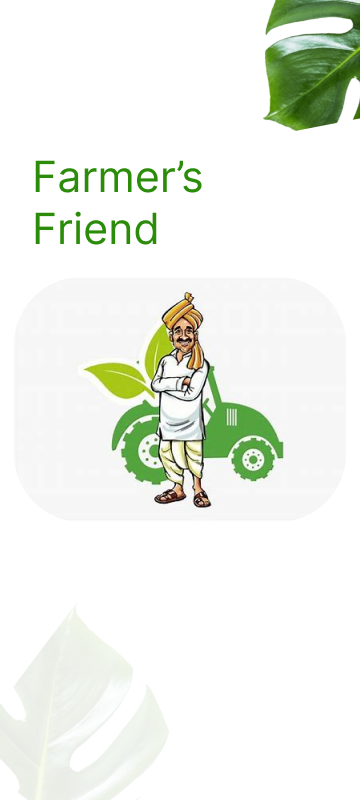 | 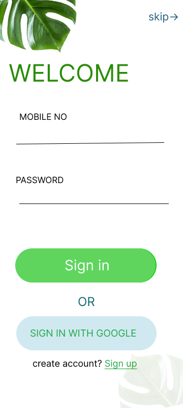 | 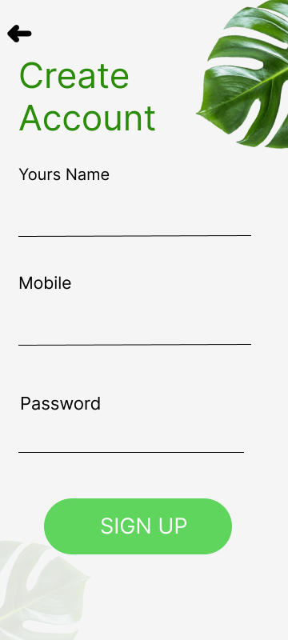 |

### Home & Main Features

| Home Page | Advisory Center | Weather |
|---|---|---|
| 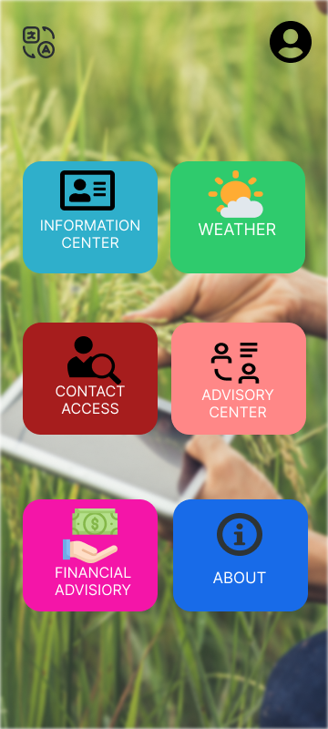 | 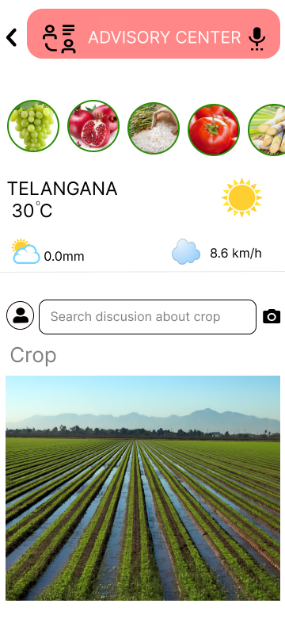 | 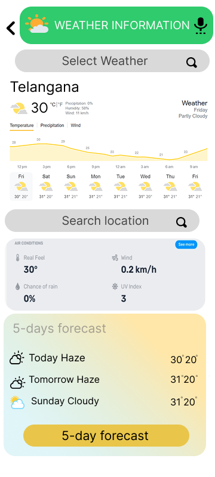 |

### Crop Advisory

| Grapes | Sugarcane | Tomato |
|---|---|---|
| 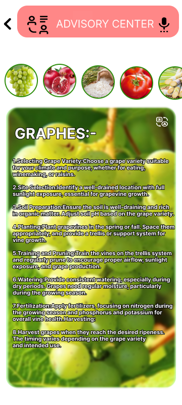 | 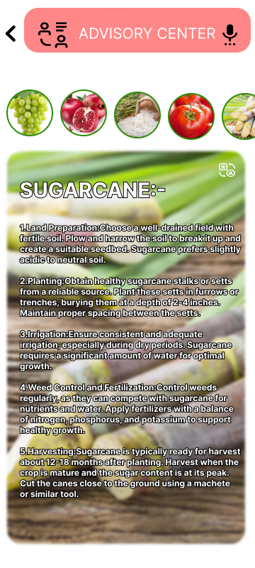 | 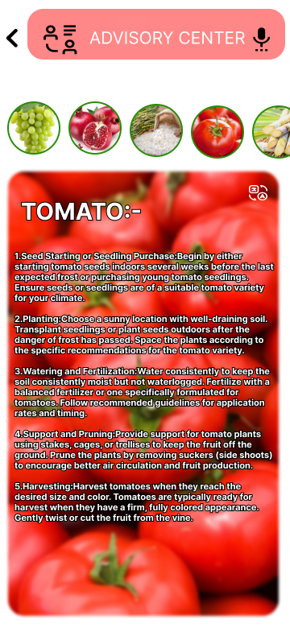 |

| Pomegranate | Wheat |
|---|---|
| 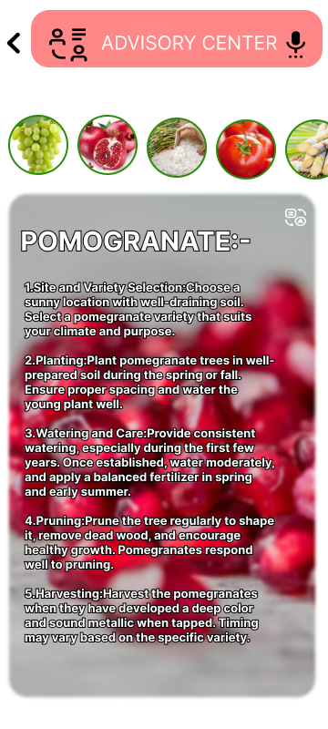 | 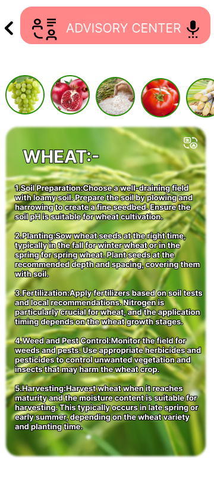 |

### Additional Features

| Financial Advisor | Information Center | Contact Access |
|---|---|---|
| 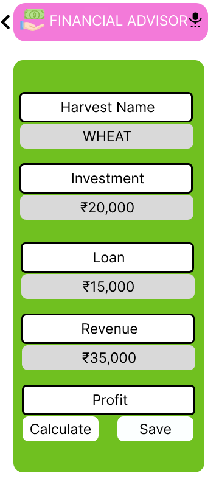 | 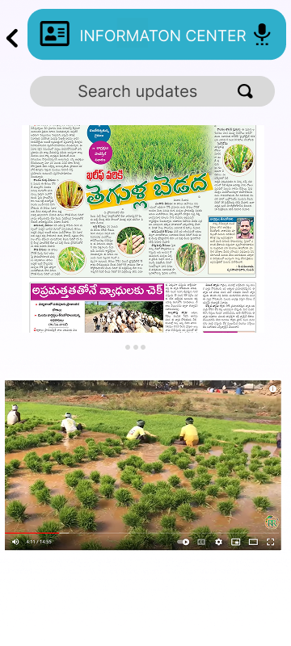 | 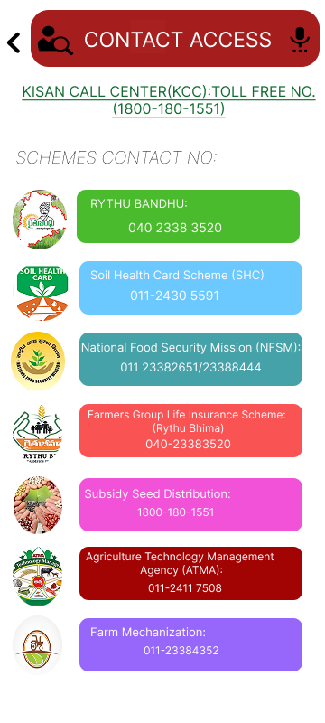 |

### About

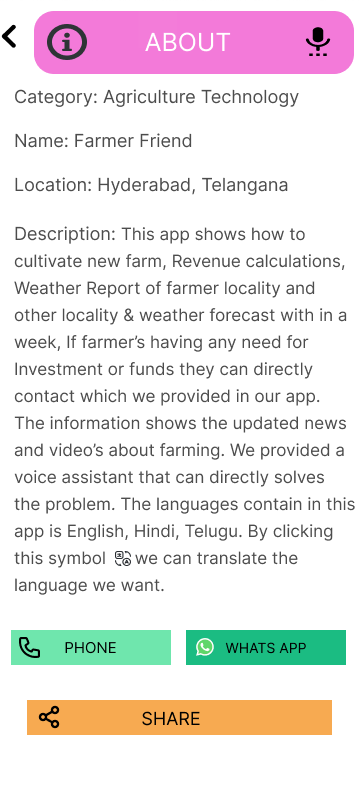

## 🛠️ Tools Used

- **Figma** — UI/UX design and prototyping
- **Figma components & layouts** — interface design
- **Mobile-first design approach**

## 🔗 Figma Prototype

[**View Farmer's Friend on Figma →**](https://www.figma.com/design/fslI4eX70vVIf2hTXhNmy2/Agriculture?node-id=0-1&t=3MCzRKhpMvcNETui-1)

## 📍 Project Information

- **Project:** Farmer's Friend
- **Category:** Agriculture Technology
- **Design Type:** Mobile UI/UX
- **Design Location:** Hyderabad, Telangana
- **Platform Concept:** Mobile application

## 🚀 Future Development

The UI/UX concept can be extended into a working application with:

- Android application
- Responsive web version
- Real-time weather API
- Crop recommendation system
- Multilingual support
- Voice assistant
- Agricultural marketplace
- Government scheme information
- Farmer community/discussion features
- Crop price/market information
- Secure user authentication
- Cloud-based farmer profiles

## 👨‍💻 Author

**K. Sai Akash**

UI/UX Design • Agriculture Technology • Mobile App Design

## 📄 License

This project is shared for educational, portfolio, and demonstration purposes. See `LICENSE` for details.
